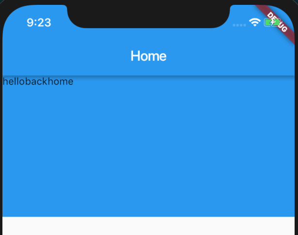

## 详解 pubspec.yaml 包管理

Flutter 沿用了 Dart 生态系统来进行包的管理，pubspec.yaml 就如同 Node.js 的 package.json 文件，只不过 pubspec.yaml 的语法可能稍微让我们感到诧异。在 Node.js 的生态里，如果你想安装一些包，需要输入 npm install，但在 Flutter 里需要使用 flutter packages get 来安装；和 package.json 一样 pubspec.yaml 也分离了两个环境，可用于开发者在不同的环境下进行开发，dependencies 和 dev_dependencies ，多数情况下，如果你有自己的包需要开发，那么你可以在主工程里的 dev_dependencies 中引入你正在开发的包。

pubspec.lock 文件可以确保你和他人协作是安装相同的版本包，如果你想升级包则可以运行 flutter packages upgrade 命令，它会安装 pubspec.yaml 指定约束的最高可用版本。pubspec.yaml 的约束规则也和 package.json 文件非常相同：

- '^0.0.1' 它的变化类似更新y位
- '>=0.1.2 <0.2.0' 可以指定一个区间

pubspec.yaml 不仅可以从市场的仓库安装也可以本地或者git，这一点上和 npm 提供的功能类似，甚至比它更方便：

```bash
// 本地安装，假设包的路径为 ~/icepy

dependencies:
  icepy:
    path: ~/icepy
```

```bash
// 从 git 处安装，假设 git 地址为 git://github.com/icepy/plugin1.git

dependencies:
  icepy:
    git:
      url: git://github.com/icepy/plugin1.git
```

```bash
// 如果你的包不在 git 仓库的根目录，你也可以指定它的 path

dependencies:
  icepy:
    git:
      url: git://github.com/icepy/plugin1.git
      path: packages/url
```

多数情况下也许我们需要开发一个自己的包，因为从代码的设计角度上来说，这种分离非常有意义，让我们来看一看如何发布一个包，一个最小的包结构如图：



你需要一个 pubspec.yaml 和 一个 lib 目录

在 pubspec.yaml 文件中我们可以写一下包名，描述等等之类的：

```yaml
name: icepyfetch  # 包名
description: my fetch # 包的描述 
version: 0.0.1 # 包的版本
author: icepy # 包的作者
homepage: https://github.com/icepy # 包的网页地址

environment: # 指定环境
  sdk: ">=2.0.0-dev.68.0 <3.0.0"

dependencies: # 指定包的依赖
  flutter:
    sdk: flutter

flutter:
  plugin: 
    androidPackage: com.example.icepy.fetch # 指定 andorind 的包名
    pluginClass: IcepyFetchPlugin # 指定 plugin的类名
```

理想情况下一个包应该还要有它的测试用例，我们应该遵循官方给出的设计目录结构。


当我们的包有多个文件时，你应该在 main.dart 中指定 library 然后导出这些文件，比如：

```dart
library icepy;

export 'src/utils.dart'
```

如果你的包是应用在 Flutter 中，那么可以运行 flutter packages pub publish 来发布。