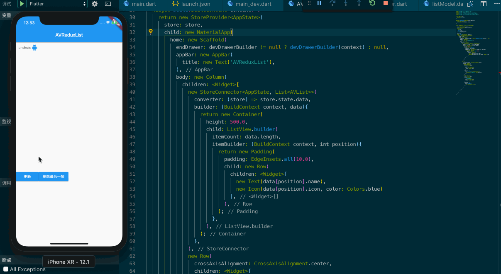
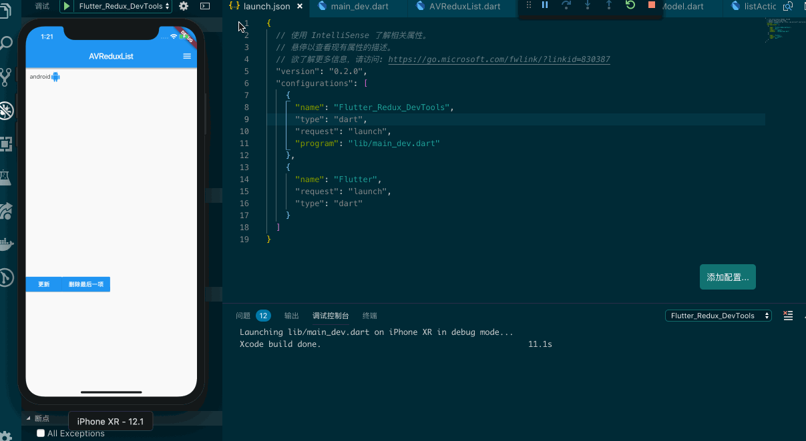

React 生态里广为人知的 Redux 状态管理，其实在 Flutter 中也能适用，它能很好的处理单一数据和状态共享，在一定程度上对于分割项目之间复杂的业务有一定的积极作用，可阅读可维护也能做的很不错。对于使用过 React 的前端开发来说 Redux 的概念肯定熟记于心了，不过我还是要简单说一些东西，只有这样我们才能更好的进入下一个环节。

Redux 主要由三个部分组成：Store，Action，Reducer

- Action 用于定义数据变化的行为（至少在语义上我们应该定义明确的行为）
- Reducer 用于根据 Action 来产生新的状态
- Store 用于存储和管理 state

这个项目的 Redux 例子使用了如下两个 package：

- [https://github.com/brianegan/flutter_redux](https://github.com/brianegan/flutter_redux)
- [https://github.com/brianegan/flutter_redux_dev_tools](https://github.com/brianegan/flutter_redux_dev_tools)

让我们先来看一看具体的效果图：



根据效果来分析我们的 Store 至少是一个数组，数组里面是一个对象，这个对象至少有两个属性分别是 name 和 icon，那么我们应该先来定义全局的 state 和 这个对象。

```dart

// 全局 state

class AppState {
  List<AVList> data;
  AppState(this.data);
}

```

```dart
import 'package:flutter/material.dart';

// 具体使用的对象
class AVList {
  final String name;
  final IconData icon;

  AVList(this.name, this.icon);

  AVList.fromJSON(Map<String, dynamic> json)
         :name = json['name'],
         icon = json['icon'];
}
```

你能看见它们分别做了两件事情，往ListView中添加一个Item，将最后一个Item从ListView中删除，那么接下来我们要定义它们的Action和Reducer。

```dart
// Action
import 'package:my_flutter_app/flow/listModel.dart';

List<AVList> addItem(List<AVList> avLists, action){
  avLists.add(action.avLists[0]);
  return avLists;
}

List<AVList> removeItem(List<AVList> avLists, action){
  avLists.removeLast();
  return avLists;
}
```

```dart
import 'package:redux/redux.dart';
import 'package:my_flutter_app/flow/listModel.dart';
import 'package:my_flutter_app/flow/listActions.dart';


final ListReducer = combineReducers<List<AVList>>([
  TypedReducer<List<AVList>, AddAVListAction>(addItem),
  TypedReducer<List<AVList>, RemoveAVListAction>(removeItem)
]);

class AddAVListAction {
  final List<AVList> avLists;
  AddAVListAction(this.avLists);
}

class RemoveAVListAction {}
```

我们可以使用 combineReducers 来注册你的 Action，并且使用 TypedReducer 来映射你的 Action。

现在，我们可以在 main.dart 中定义你全局的 Store 和 Reducer ：

```dart

AppState appReducer(AppState state, action) {
  return new AppState(
    ListReducer(state.data, action)
  );
}

final store = new Store<AppState>(
  appReducer,
  initialState: new AppState([new AVList("android", Icons.android)])
);
```

之前我们定义的数据结构中是一个List，其中对象的类型是AVList，因为我们可以在初始化的时候给它一个默认值。

接下来我们可以来完善 Widget 这一层，在这一层中基本上我们需要做：

- Widget 绑定 Store 中的 state
- Widget 触发某个 Action
- Reducer 根据某个 Action 触发更新 state
- 更新 Store 中 state 绑定的 Widget

在这里我们会使用到几个 Widget 和一个 Dispatch 来完成上述的步骤，第一步我们要使用 StoreProvider 它会将绑定的 Store 传递给它的所有子 Widget ，其次我们需要使用 StoreConnector 它会将更新后的数据 callback 给你，最后我们会使用 dispatch 来执行某些 Action ，完成某些 state 的操作。

完整的例子：

```dart
import 'package:flutter/material.dart';
import 'package:redux/redux.dart';
import 'package:flutter_redux/flutter_redux.dart';
import 'package:my_flutter_app/flow/listModel.dart';
import 'package:my_flutter_app/flow/listReducer.dart';

class AppState {
  List<AVList> data;
  AppState(this.data);
}

AppState appReducer(AppState state, action) {
  return new AppState(
    ListReducer(state.data, action)
  );
}

class AVReduxList extends StatelessWidget {
  
  final Store<AppState> store;
  
  AVReduxList({
    Key key, 
    this.store
  }): super(key:key);

  @override
  Widget build(BuildContext context) {
    return new StoreProvider<AppState>(
      store: store,
      child: new MaterialApp(
        home: new Scaffold(
          appBar: new AppBar(
            title: new Text('AVReduxList'),
          ),
          body: new Column(
            children: <Widget>[
              new StoreConnector<AppState, List<AVList>>(
                converter: (store) => store.state.data,
                builder: (BuildContext context, data){
                  return new Container(
                    height: 500.0,
                    child: ListView.builder(
                      itemCount: data.length,
                      itemBuilder: (BuildContext context, int position){
                        return new Padding(
                          padding: EdgeInsets.all(10.0),
                          child: new Row(
                            children: <Widget>[
                              new Text(data[position].name),
                              new Icon(data[position].icon, color: Colors.blue)
                            ],
                          ),
                        );
                      },
                    ),
                  );
                },
              ),
              new Row(
                crossAxisAlignment: CrossAxisAlignment.center,
                children: <Widget>[
                  new RaisedButton(
                    color: Colors.blue,
                    child: new Text(
                      '更新',
                      style: new TextStyle(
                        color: Colors.white
                      ),
                    ),
                    onPressed: (){
                      store.dispatch(new AddAVListAction(
                        [new AVList("android", Icons.android)]
                      ));
                    },
                  ),
                  new RaisedButton(
                    color: Colors.blue,
                    child: new Text(
                      '删除最后一项',
                      style: new TextStyle(
                        color: Colors.white
                      ),
                    ),
                    onPressed: (){
                      store.dispatch(
                        new RemoveAVListAction()
                      );
                    },
                  )
                ],
              )
            ],
          ),
        ),
      )
    );
  }
}
```

## Redux Dev Tools

这是一个类似 Redux Time Travel 的 UI 小工具，在开发阶段我们可以使用这个工具来追溯你的操作，因此我们需要重新定义一个入口文件 main_dev.dart：

```dart
import 'package:flutter/material.dart';
import 'package:flutter_redux_dev_tools/flutter_redux_dev_tools.dart';
import 'package:redux_dev_tools/redux_dev_tools.dart';
import 'package:my_flutter_app/AVReduxList.dart';
import 'package:my_flutter_app/flow/listModel.dart';


void main(){
  final store = new DevToolsStore<AppState>(
    appReducer,
    initialState: new AppState([new AVList("android", Icons.android)])
  );
  runApp(new ReduxDevToolsContainer(
    store: store,
    child: new AVReduxList(
      store: store,
      devDrawerBuilder: (BuildContext context){
        return new Drawer(
          child: new Padding(
            padding: new EdgeInsets.only(top: 24.0),
            child: new ReduxDevTools(store),
          ),
        );
      },
    ),
  ));
}
```

在这里我们需要使用 DevToolsStore 来定义你的全局 Store ，另外我们还需要对原来的 AVReduxList进行一些改造，增加一个 devDrawerBuilder 属性来控制 DevTools 的绘制。

```dart
// AVReduxList.dart

class AVReduxList extends StatelessWidget {
  
  final Store<AppState> store;
  final WidgetBuilder devDrawerBuilder;
  
  AVReduxList({
    Key key, 
    this.store,
    this.devDrawerBuilder
  }): super(key:key);

  @override
  Widget build(BuildContext context) {
    return new StoreProvider<AppState>(
      store: store,
      child: new MaterialApp(
        home: new Scaffold(
          endDrawer: devDrawerBuilder != null ? devDrawerBuilder(context) : null,
          ...
        )
      )
    )
  }
}

```

最后，我们在 VSCode 中重新添加一个新的启动项：

```javascript
{
  "name": "Flutter_Redux_DevTools",
  "type": "dart",
  "request": "launch",
  "program": "lib/main_dev.dart"
},
```

效果图：

