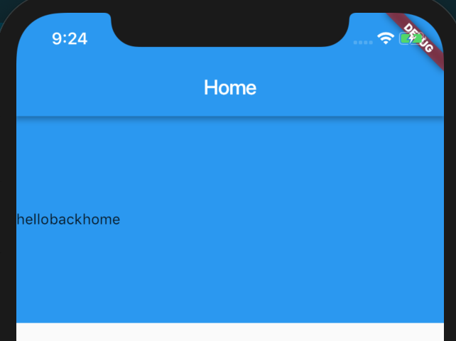
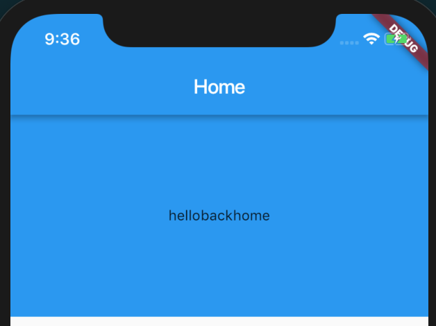
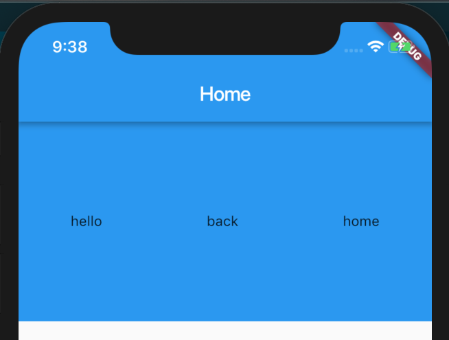
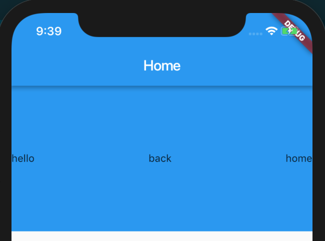
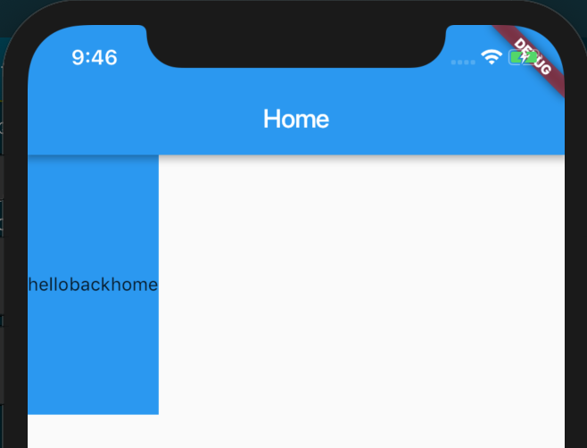

## Row

> A widget that displays its children in a horizontal array.

Row 的布局行为继承于 Flex，我们可以完全按照 Web 中的 Flex 来参考，包括主轴，交叉轴等概念。

通过构造函数我们可以看到它们的默认值；

```dart
Row({
  Key key,
  MainAxisAlignment mainAxisAlignment = MainAxisAlignment.start,
  MainAxisSize mainAxisSize = MainAxisSize.max,
  CrossAxisAlignment crossAxisAlignment = CrossAxisAlignment.center,
  TextDirection textDirection,
  VerticalDirection verticalDirection = VerticalDirection.down,
  TextBaseline textBaseline,
  List<Widget> children = const <Widget>[],
})
```

### crossAxisAlignment

它的作用可以让 children 元素在交叉轴方向上排列展示方式，它一共有五个属性，这里我只举例三种最常用的属性，其他属性可参考 [https://docs.flutter.io/flutter/rendering/CrossAxisAlignment-class.html](https://docs.flutter.io/flutter/rendering/CrossAxisAlignment-class.html)。

**CrossAxisAlignment.end**


**CrossAxisAlignment.center**



**CrossAxisAlignment.start**


> 它的约束执行依赖于你设置的最大高度

### mainAxisAlignment

它的作用可以让 children 元素在主轴的方向上排列展示方式，它一共有六个属性，这里我只举例四种最常用的属性，其他属性可参考 [https://docs.flutter.io/flutter/rendering/MainAxisAlignment-class.html](https://docs.flutter.io/flutter/rendering/MainAxisAlignment-class.html)。

**MainAxisAlignment.center**



**MainAxisAlignment.end**


**MainAxisAlignment.spaceAround**

spaceAround 可以将 children 之间的空白区域均等的分隔。



**MainAxisAlignment.spaceBetween**

spaceBetween 可以将 children 之间的空白区域均等分隔，但是首尾两个元素都靠近边界的首尾。



### mainAxisSize

这个属性可以设置主轴方向占用空间，它只有两个属性，默认值是 max ，不过我们可以看一看 min 显示效果：



[https://docs.flutter.io/flutter/widgets/Flex/mainAxisSize.html](https://docs.flutter.io/flutter/widgets/Flex/mainAxisSize.html)

### verticalDirection

这个属性可以控制布局方式的走向，它只有两个属性，默认值是 down ，另外一个值是 up ，这两个属性顾名思义，一般UI的绘制都是从顶部往下绘制，如果你设置了 up ，那么绘制的走向就变成了从底部往上绘制。

[https://docs.flutter.io/flutter/widgets/Flex/verticalDirection.html](https://docs.flutter.io/flutter/widgets/Flex/verticalDirection.html)

